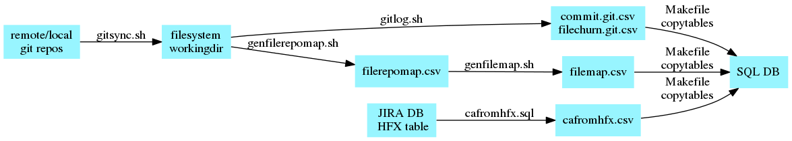

# XSCodeChurn

####Set of scripts to analyse XenServer code churn

git repos (listed in [`gitrepos.csv`](inputs/gitrepos.csv)) are cloned/pulled.

[`gitlog.sh`](gitlog.sh) invokes `git --log` and postprocess with ([`commit.gitlog2csv.pl`](commit.gitlog2csv.pl) and [`filechurn.gitlog2csv.pl`](filechurn.gitlog2csv.pl)) to produce:
* `commit.git.csv`: repo,uuid,author,date,summary
* `filechurn.git.csv`: repo,uuid,file,added,rm'd,churn

[`genfilerepomap.sh`](genfilerepomap.sh) and [`genfilemap.sh`](genfilemap.sh) generate:
* `filerepomap.csv`: repo,file
* `filemap`: repo,file,extension,#line of code (loc)

These csv files are then imported in a postgreSQL db [`schema.sql`](sql/schema.sql), (see [`Makefile copytables` target](Makefile))

A number of SQL queries can then be run, e.g. [`churnbyCA.sql`](sql/churnbyCA.sql), which returns a table containing: 
* filename, repo, number of issues, total churn, loc, %churn

workflow
----

dependencies
----
* [sqlite3](https://www.sqlite.org/)

* [cloc](https://github.com/AlDanial/cloc)

* [gnuplot](http://www.gnuplot.info/)

